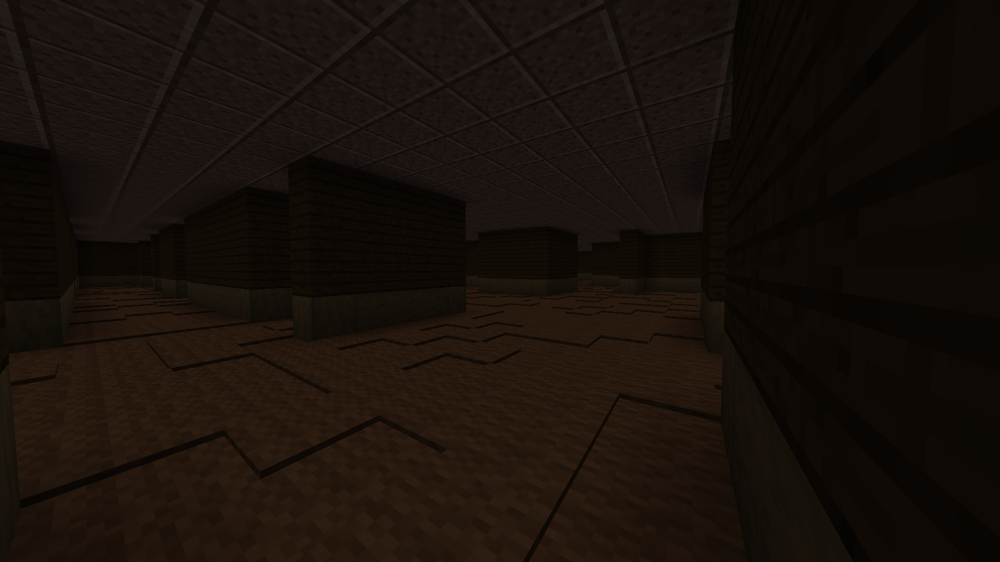
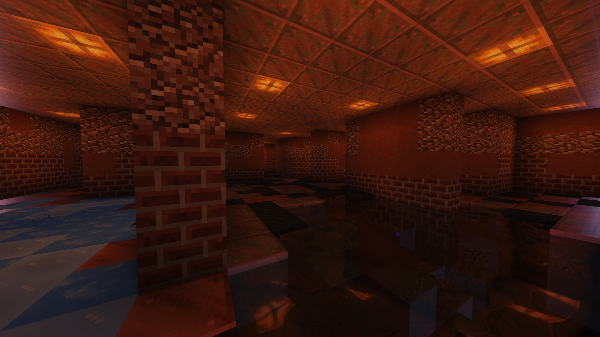
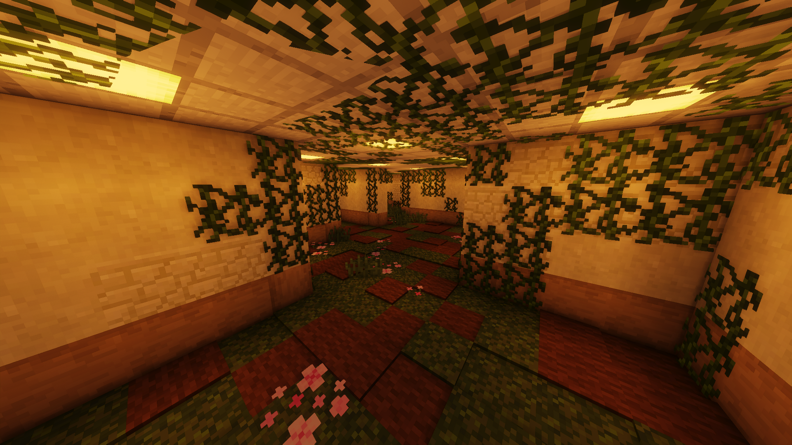
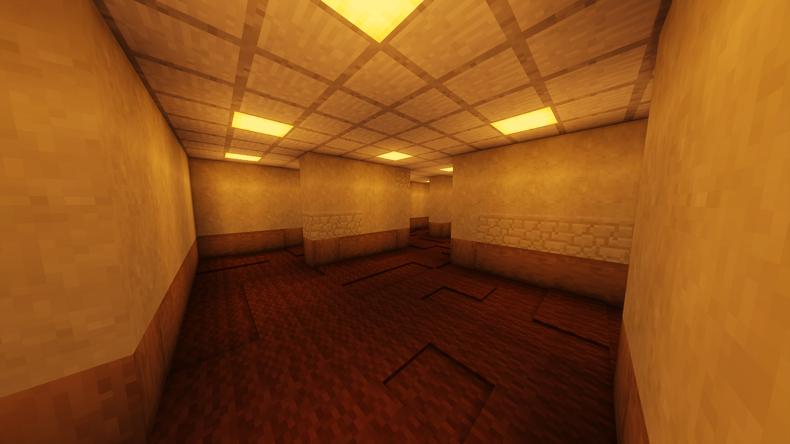
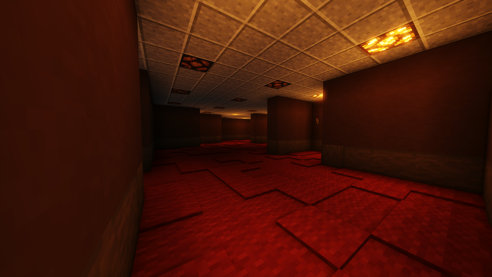
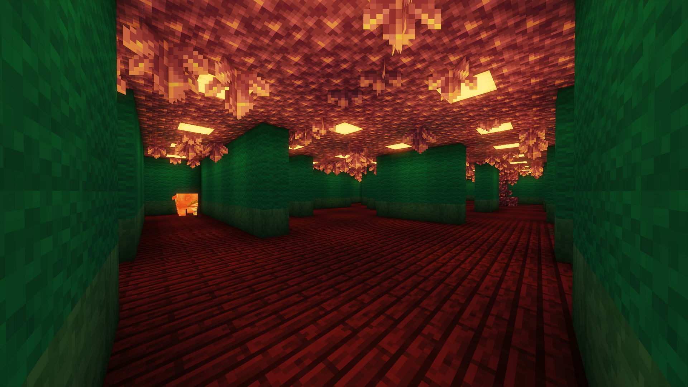

The Backrooms
=======================

The Backrooms is a new modded and completely original dimension. It features unique challenging mobs to fight but also huge rewards in terms of item evolutions to upgrade your gear.

.. _portal-device-instructions:
Instructions
----------------

#. This experience is reccomended after you have maxed out netherite gear and a raid farm to fill your inventory with totems of undying.

#. Craft a Portal Device using the recipe below:

   .. image:: images/portal_device_recipe.png

#. Build the portal's structure as shown.
  
   Materials required:
   
   * 4x Glowstone

   * 8x Oxidised Copper (waxed oxidised copper is okay too)

   * 4x Smooth Stone

   * Water

   * 1x Portal Device (place anywhere on the portal's rim)

   .. image:: images/portal_device_structure.png
      :height: 360

#. Configure the portal device by right clicking it.

   Portal devices that have the same code will point to the same destination.

   This allows server members to explore The Backrooms seperately and not have to fight for loot, while still being able to collaborate and play with each other.

   .. image:: images/portal_device_code_menu.png

#. Jump in the water to start your adventure!

Gameplay
----------------

To prevent keepinventory PvP abuse, friendly fire is disabled in The Backrooms. Fall damage is also disabled.

The first time you die in The Backrooms, you will keep your levels and inventory. The next time you die, you will drop everything!

One way to recover your items is to use the :ref:`Invisibillity Cloak<invis-cloak>` which makes you undetectable to mobs as long as you don't have any other items in your inventory.

Evolutions
----------------

Evolutions are CryptoCraft's version of enchantments. Items may only hold a maximum of 1 evolution at a time, applying another will overwrite the existing one.

You can find evolution stones in chests around all floors of The Backrooms. Each floor has a set of unique evolutions that can spawn in the chests. 

You'll need to craft the evolution stones into evolution cores, which require evolution crystals among other items. Use the recipe book to find the recipes. Apply the evolution cores to supported items via an anvil.

A list of evolutions can be found below with each level.

Levels
----------------

There are currently 6 levels in The Backrooms. They are listed here from highest to lowest. Backrooms levels have elevator structures that can take you up and down a floor.

.. _level-dark:
Dark (3)
^^^^^^^^^^^

Entities: :ref:`Gasser<entity-gasser>`, :ref:`Howler<entity-howler>`, :ref:`Wretch<entity-wretch>`

(the brightness in the screenshot has been increased)

.. _level-sewer:
Sewer (2)
^^^^^^^^^^^

Entities: :ref:`Mite<entity-mite>`, :ref:`Infested Wretch<entity-infested-wretch>`, :ref:`Lurker<entity-lurker>`

.. _level-garden:
Garden (1)
^^^^^^^^^^^

Entities: :ref:`Wretch<entity-wretch>`

.. _level-hallway:
Hallway (0)
^^^^^^^^^^^

Entities: :ref:`Hound<entity-hound>`, :ref:`Howler<entity-howler>`, :ref:`Smiler<entity-smiler>`

Evolutions:

* **Lightning**

  * The next entity you hit gets struck by lightning. Deal 3x extra damage to entities and 2x damage to players.

  * Items: Hammer

* **Dash**

  * Holding the weapon for a few seconds grants you speed 2.

  * Items: Katana

* **Sniper**

  * Shot arrows travel instantly to your crosshair target without gravity drop/falloff.

  * Items: Bow, Crossbow

* **Cooldown Cut down**

  * Increases attack speed by 40%

  * Items: All Swords (except Hammers and Greatswords)

* **Paledon**

  * Standing still makes you take less knockback and damage.

  * Items: Hammer

* **Sprint**

  * Continously running will give you a speed boost.

  * Items: Leggings

* **NoFall**

  * Take no fall or elytra wall damage.

  * Items: Leggings

.. _level-red:
Red (-1)
^^^^^^^^^^^

Entities: :ref:`Hound<entity-hound>`, :ref:`Howler<entity-howler>`, :ref:`Spooky Creeper<entity-spooky-creeper>`, :ref:`Slow Joe<entity-slow-joe>`, :ref:`Goblin<entity-goblin>`

Evolutions:

* **Necromancer**

  * Mobs killed with this weapon spawn bowless skeletons that fight for you.

  * Items: Greatswords

* **Vampire**
 
  * Heal 5hp (2 and a half hearts) for every mob you kill

  * Items: All Swords (not the Hammer)

* **Parry**

  * Attacking right after blocking damage from your shield deals up to 2.5x more damage

  * Items: Shield

* **Bedrock Smasher**

  * Breaks bedrock. Doesn't drop the item.

  * Items: Pickaxes

* **Demolition**

  * Destroys dirt, sand snow and stones in a 4 block radius on the block you're looking at. Leaves ores intact, only 50% of blocks drop items.

  * Cooldown: 7.5s

* **Jetpack**

  * Sneaking while flying boosts you in the air like when using fireworks. Boost lasts for 10 seconds, recharges while on ground.

  * Items: Elytra

* **Elytra Chestplate**

  * Gives you the protection, toughness and knockback resistance of an unenchanted netherite chestplate.

  * Items: Elytra

.. _level-spirit:
Spirit (-2)
^^^^^^^^^^^

Entities: :ref:`Bricked Up Wretch<entity-bricked-wretch>`, :ref:`Hog<entity-hog>`, :ref:`Buffed Goblin<entity-buffed-goblin>`

Evolutions:

* **Rupture**

  * The next arrow you shoot spawns an end crystal that doesn't break blocks.

  * Cooldown: 15s

  * Items: Bow, Crossbow

* **Chaos**

  * Arrows you shoot have random potion effects.

  * Items: Bow, Crossbow

* **Poison Edge**

  * Attacking mobs gives them poison 2 for 5 seconds. Attacking players gives them poison 1 for 5 seconds.

  * Items: All Swords (not the Hammer)

* **Ground Pound**

  * Launch a ground pound that does 18-28 damage to nearby entities.

  * Cooldown: 15s

  * Items: Hammer

* **Fireball**

  * Launch a fireball that doesn't break blocks.

  * Cooldown: 15s

  * Items: All Swords (not the Hammer)

* **Deflect**

  * Take 60% less projectile damage. Enemies that attack you will be knocked back.

  * Items: Chestplates

* **Overshield**

  * Being undamaged for 7.5 seconds heals up to 5 absorption hearts.

  * Items: Chestplates

Entities
--------------

Each level has a set of unique mobs that attempt to kill you. They are designed to be challenging, so they will significantly more damage and have more health than normal mobs. 

Entity stats sometimes change and may not be fully up to date with this page.

These mobs also drop custom items which are mainly used as crafting ingredients and serve no other purpose.

.. _entity-gasser:
Gasser
^^^^^^^^^^^
A cave spider that drops a harming II potion when killed. When the Gasser damages a player, it doesn't inflict poison.

* Damage: 16.5

* Health: 25

Found in: :ref:`Dark<level-dark>`

Drops: Gas Sack (ingredient), Fermented Spider Eye

.. _entity-goblin:
Goblin
^^^^^^^^^^^
A baby zombie that runs fast. It starts with high armour, blocking 80% of damage. As the goblin runs around, it loses its defense. 

* Damage: 15

* Health: 20

Found in: :ref:`Red<level-red>`

Drops: Goblin Eye (ingredient), Goblin Gem (ingredient),

.. _entity-buffed-goblin:
Buffed Goblin
^^^^^^^^^^^
Buffed goblins have the same stats as goblins, but they wear gold leggings and boots and take more distance to lose their defense.

Found in: :ref:`Spirit<level-spirit>`

Drops: Goblin Eye (ingredient), Goblin Gem (ingredient), Golden Goblin Gem (rare ingredient)

.. _entity-hog:
Hog
^^^^^^^^^^^
Zoglins that are packed with tons of health and recieve no knockback. They are meant to be annoying.

* Damage: 15

* Health: 120

Found in: :ref:`Spirit<level-spirit>`

Drops: Poisionous Potato (rare drop)

.. _entity-hound:
Hound
^^^^^^^^^^^
Wolves that run around and actively attempt to kill players. They spawn in packs of 4-10 and follow each other around.

* Damage: 12

* Health: 23

Found in: :ref:`Hallway<level-hallway>`

Drops: Hound Fur (ingredient), Hound Tooth (ingredient), Rotten Flesh

.. _entity-buffed-hound:
Buffed Hound
^^^^^^^^^^^

* Damage: 15

* Health: 30

Found in: :ref:`Red<level-red>`

Drops: Same as regular

.. _entity-howler:
Howler
^^^^^^^^^^^
A wither skeleton that acts as a miniboss of the server. It recieves a speed boost and also takes no knockback, making chasing down players very easy.

* Damage: 33

* Health: 170

Found in: :ref:`Hallway<level-hallway>`, :ref:`Red<level-red>`, :ref:`Dark<level-dark>`

Drops: Howler Heart (~50% chance with looting 3)

.. _entity-lurker:
Lurker
^^^^^^^^^^^
A Drowned Zombie that mostly stays in the water. It does not attack players who are not in water. When hit, players recieve the darkness and weakness effect for 10 seconds.

* Damage: 45

* Health: 20

Found in: :ref:`Sewer<level-sewer>`

Drops: Rotten Flesh, Slime Ball

.. _entity-mite:
Mite
^^^^^^^^^^^
A silverfish that is fast in land and on water.

* Damage: 13.5

* Health: 18

Found in: :ref:`Sewer<level-sewer>`

Drops: Mite Scale (ingredient)

.. _entity-slow-joe:
Slow Joe
^^^^^^^^^^^
A Stray skeleton without a bow. Hit players recieve Slowness for 10 seconds.

* Damage: 15

* Health: 40

Found in: :ref:`Red<level-red>`

Drops: Fermented Spider Eye, Sugar

.. _entity-smiler:
Smiler
^^^^^^^^^^^
An invisible zombie that wears leather boots and makes no sound. The first time it hits a player, it deals 3.75x more damage.

* Damage: 18 (49.5 for first hit)

* Health: 20

Found in: :ref:`Hallway<level-hallway>`

Drops: Phantom Membrane

.. _entity-spooky-creeper:
Spooky Creeper
^^^^^^^^^^^
A buffed creeper that deals significantly more damage than a regular creeper (but less than a charged creeper). It's fuse time is also significantly reduced, almost instantly exploding when it reaches it's target.

* Health: 20

Found in: :ref:`Red<level-red>`

Drops: Nothing

.. _entity-wretch:
Wretch
^^^^^^^^^^^
An unarmed skeleton which does absolutely nothing special and attacks the player with it's fists.

* Damage: 16.5

* Health: 40

Found in: :ref:`Garden<level-garden>`, :ref:`Dark<level-dark>`

Drops: Bone

.. _entity-bricked-wretch:
Bricked Up Wretch
^^^^^^^^^^^
A Wretch with full diamond gear. There are no changes to its' stats but the diamond armour obviously makes them harder to kill.

Found in: :ref:`Spirit<level-spirit>`

Drops: Bone, Diamond

.. _entity-infested-wretch:
Infested Wretch
^^^^^^^^^^^
A Wretch with chain leggings and boots. Every 10m it walks, and every time a player attacks the wretch, the wretch spawns a :ref:`Mite<mite>`.

* Damage: 16.5

* Health: 55

Found in: :ref:`Sewer<level-sewer>`

Drops: Bone
