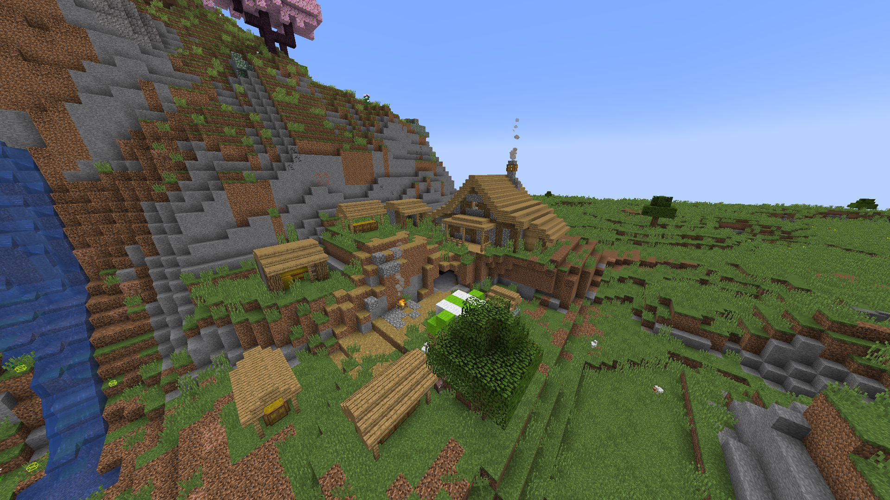
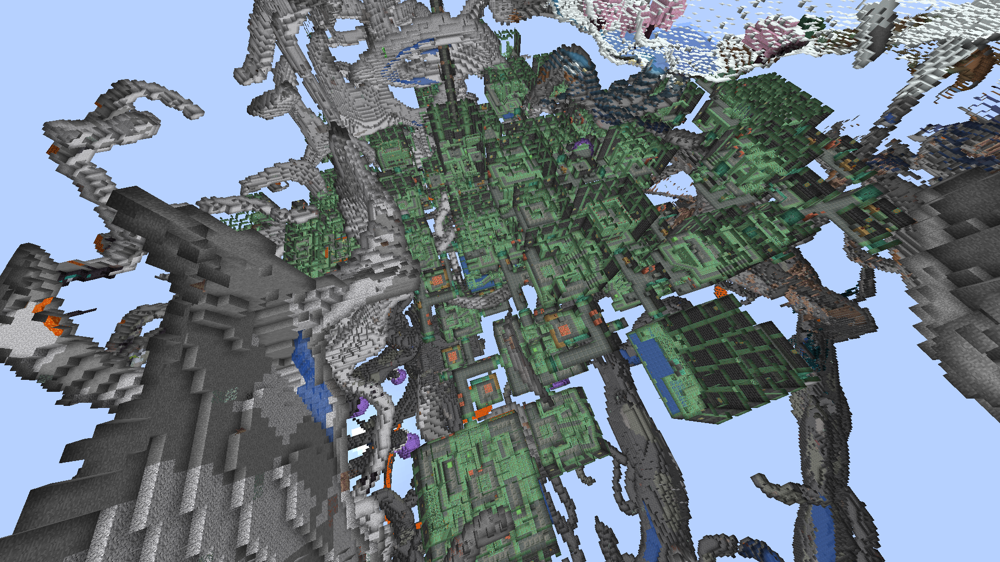

World Generation
###########

CryptoCraft features 5 datapacks that modify world generation and gameplay experiences across all 3 vanilla dimensions.

To explore the datapacks further, click on the links below.

List of datapacks:

* `Dungeons and Taverns <https://www.curseforge.com/minecraft/mc-mods/dungeon-and-taverns>`_ adds larger structures across all 3 dimensions, including custom trial chambers. It adds custom enchantments, however many of them are disabled in CryptoCraft.

* `Terralith <https://stardustlabs.miraheze.org/wiki/Terralith>`_ aims to enhance the Overworld by adding custom biomes and structures.

* `Incendium <https://stardustlabs.miraheze.org/wiki/Incendium>`_ aims to enhance the Nether by adding new biomes, structures, mobs and rewards.

* `Nullscape <https://stardustlabs.miraheze.org/wiki/Nullscape>`_ changes the End by adding new biomes and raising the world height.

* `Structory <https://stardustlabs.miraheze.org/wiki/Structory>`_ adds small structures to enhance the feel of the world.

Trial Spawners
**********
Trial spawners (and accompanying vaults) are also present throughout a lot of Dungeons and Taverns structures (especially larger structures) in all 3 dimensions.

These structures are not necessarily called "trial chambers", they have a lot of different names.

Vaults in these structures cannot be unlocked with normal keys, they must be unlocked with custom keys which only drop/spawn in the respective structure.

Overworld
**********
The Overworld contains many new structures from multiple datapacks. Most structures only enhance visual quality and do not give good loot.

Tavern
===========

These structures are the main way to obtain maps for other Dungeons and Taverns structures in the overworld.

Trading with the cartographer villager inside once will unlock new trades that give you structure maps.

The maps offered can point to Dungeons and Taverns structures or vanilla structures.  

Shrines
===========
Dungeons and Taverns add "shrines", which are trial chambers that could either be extremely small with a few rooms to being 2-3x larger than regular trial chambers. Larger shrines are much rarer to occur.

A level 6 shrine (the maximum level)

Nether
**********
`Incendium <https://stardustlabs.miraheze.org/wiki/Incendium>`_ massively overhauls Nether gameplay with structures and custom items.
In CryptoCraft, Incendium custom items have been replaced with :doc:`loot-boxes` that give you diamonds, enchantments and netherrite.

Some Incendium structures are extremely difficult and should only be attempted with multiple people or with an inventory full of totems.

