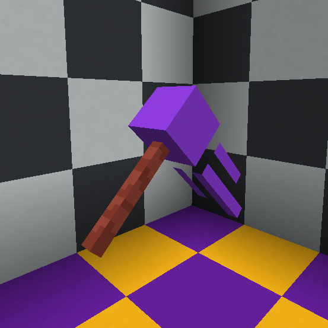

Items
***************************************

This section covers held items (mostly weapons).

Universal Tools
============
These are **special** tools which can be applied to any tool type (swords, pickaxe, axes, shovels, hoes, and the trident)

Meteor Shovel
-----------
* Pttern: "meteor"
* Items: All Tools and Weapons
* ID: "meteor_shovel"

   
Chainsaw
-----------
* Pattern: "chainsaw"
* Items: All Tools and Weapons
* ID: "chainsaw"

Melee Weapons
============
   
Doom Slayer
-----------
* Pattern: "doom slayer"
* Items: All Swords
* ID: "doom_slayer"

Leviathan Axe
-----------
* Pattern: "leviathan axe"
* Items: All Axes
* ID: "leviathan_axe"

Blade Of Blood
-----------
* Pattern: "of blood"
* Items: All Swords
* ID: "sword_of_blood"

Blade Of Ghouls
-----------
* Pattern: "of ghouls"
* Items: All Swords
* ID: "sword_of_ghouls"

Blade Of Sin
-----------
* Pattern: "of sin"
* Items: All Swords
* ID: "sword_of_sin"

Blade Of Unliving
-----------
* Pattern: "of unliving"
* Items: All Swords
* ID: "sword_of_unliving"

Blade Of a little Trolling
-----------
* Pattern: "troll"
* Items: All Swords
* ID: "troll_sword"

Bows & Crossbows
============
Bows and crossbows are actually animated, consisting of 4 animation frames.

Nothing yet! How about you make the first one?

Totems
============

There are a few totem textures, but you'll have to find them for yourself...

Other Items
============

Nothing yet! How about you make the first one?

